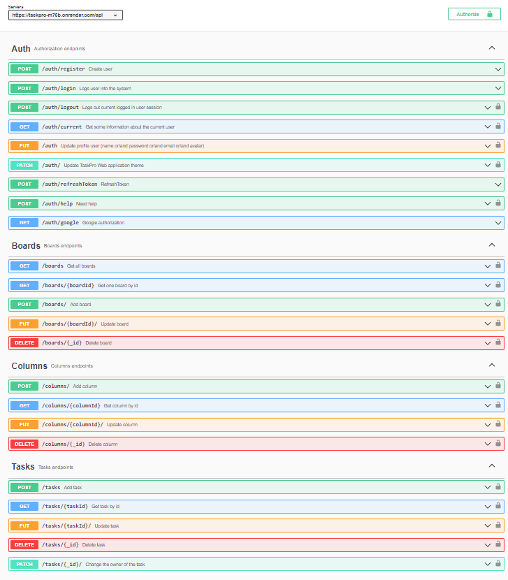

# TaskPro-backend API

This is the TaskPro API backend, which is developed for the [TaskPro](https://oleksiifedorenko.github.io/goit-team-03-front/welcome) web application:

## The developers of our backend are

- Anna (https://github.com/sav-anna);
- Tetiana (https://github.com/teti-ruzh);
- Anastasiia (https://github.com/n-ruzhik);
- Victor (https://github.com/chemvic).

## About API

### Our backend is built on:

- Node.js (version 12 or higher)
- Express.js
- Cloudinary
- Google (passport)
- Mongoose to interact with the MongoDB database.

The backend [documentation](https://taskpro-m75b.onrender.com/api-docs)
was using a package 'swagger-ui-express'

